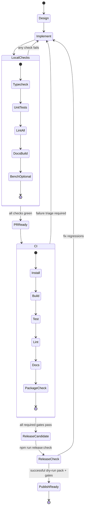

# Quality gates and release flow

This state diagram shows the expected quality path from implementation through release readiness.

## Gate intent

- **Typecheck/Test/Lint** protect runtime correctness and rule quality.
- **Docs build** ensures documentation and API pages remain valid.
- **Package checks** prevent broken public artifacts.
- **Release check** is the final integrated confidence pass.
