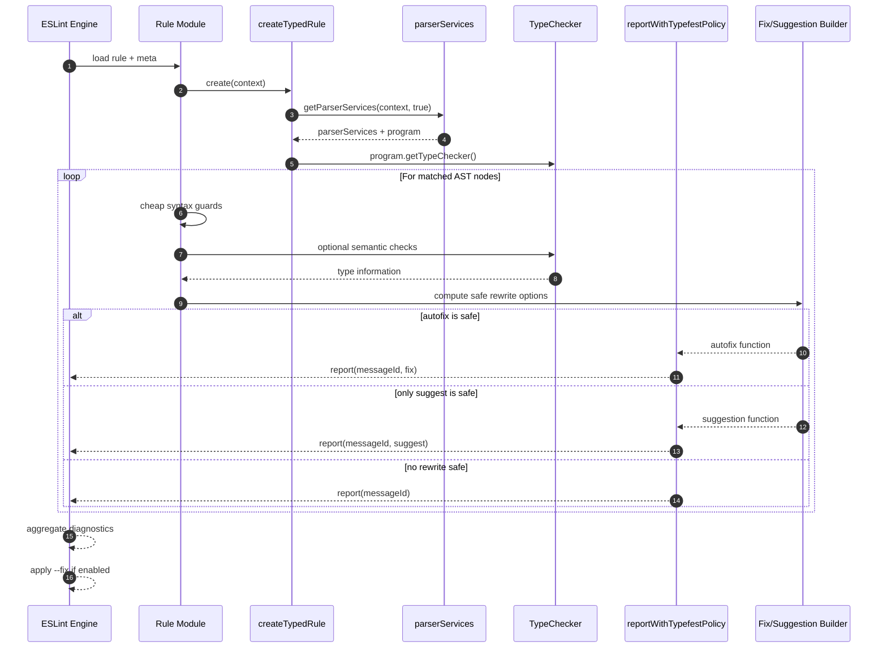

# Rule lifecycle and autofix flow

This sequence diagram models what happens from lint invocation through optional fix output.

## Safety checkpoints

- Syntax-first guards prevent expensive checker access when unnecessary.
- Type operations are wrapped with safe fallbacks to avoid linter crashes.
- Autofix only applies when parse-safe and semantic-safe constraints are met.
